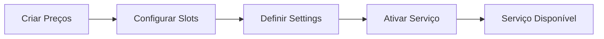
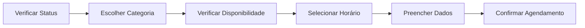

# 📚 API Documentation - Sistema de Diagnóstico RuidCar

## Visão Geral

Sistema completo de agendamentos para diagnóstico com RuidCar, incluindo endpoints para configuração (oficinas) e agendamento público (clientes).

---

## 🔐 Endpoints Autenticados (Painel da Oficina)

### Autenticação
Todos os endpoints autenticados requerem:
- Header `x-workshop-id` com o ID da oficina
- Ou query parameter `workshop_id`

---

### 1️⃣ Configuração do Serviço

#### GET /api/workshop/diagnostic/status
Retorna o status atual do serviço de diagnóstico.

**Response:**
```json
{
  "success": true,
  "data": {
    "id": 1,
    "workshopId": 3,
    "isActive": false,
    "status": "disabled",
    "validation": {
      "canActivate": false,
      "errors": ["Preços não configurados para: luxury"],
      "warnings": []
    }
  }
}
```

#### POST /api/workshop/diagnostic/toggle
Ativa ou desativa o serviço de diagnóstico.

**Request Body:**
```json
{
  "activate": true
}
```

**Response:**
```json
{
  "success": true,
  "message": "Serviço de diagnóstico ativado com sucesso",
  "data": {
    "isActive": true,
    "status": "active"
  }
}
```

#### PUT /api/workshop/diagnostic/settings
Atualiza configurações gerais de agendamento.

**Request Body:**
```json
{
  "minAdvanceHours": 2,
  "maxAdvanceDays": 30,
  "cancellationHours": 24,
  "noShowTolerance": 15,
  "autoConfirm": false,
  "sendReminders": true,
  "reminderHours": 24
}
```

---

### 2️⃣ Configuração de Preços

#### GET /api/workshop/diagnostic/pricing
Lista todos os preços configurados.

**Response:**
```json
{
  "success": true,
  "data": [
    {
      "category": "popular",
      "price": 15000,
      "estimatedDuration": 60
    },
    {
      "category": "medium",
      "price": 20000,
      "estimatedDuration": 75
    },
    {
      "category": "luxury",
      "price": 25000,
      "estimatedDuration": 90
    }
  ]
}
```

#### PUT /api/workshop/diagnostic/pricing
Cria ou atualiza preço para uma categoria.

**Request Body:**
```json
{
  "category": "popular",
  "price": 15000,
  "estimatedDuration": 60
}
```

**Categorias válidas:**
- `popular` - Popular / Linha Leve
- `medium` - Linha Média / SUV / Picape
- `luxury` - Luxo / Premium

#### DELETE /api/workshop/diagnostic/pricing/:category
Remove preço de uma categoria.

---

### 3️⃣ Gestão de Disponibilidade

#### GET /api/workshop/diagnostic/slots
Lista todos os slots de disponibilidade.

**Response:**
```json
{
  "success": true,
  "data": [
    {
      "id": 1,
      "dayOfWeek": 1,
      "startTime": "08:00",
      "endTime": "12:00",
      "capacity": 2,
      "bufferMinutes": 15,
      "isActive": true
    }
  ]
}
```

#### POST /api/workshop/diagnostic/slots
Cria novo slot de disponibilidade.

**Request Body:**
```json
{
  "dayOfWeek": 1,
  "startTime": "08:00",
  "endTime": "12:00",
  "capacity": 2,
  "bufferMinutes": 15
}
```

**Dias da semana:**
- 0 = Domingo
- 1 = Segunda-feira
- 2 = Terça-feira
- 3 = Quarta-feira
- 4 = Quinta-feira
- 5 = Sexta-feira
- 6 = Sábado

#### PUT /api/workshop/diagnostic/slots/:id
Atualiza slot existente.

#### DELETE /api/workshop/diagnostic/slots/:id
Remove slot de disponibilidade.

---

### 4️⃣ Exceções de Agenda

#### GET /api/workshop/diagnostic/exceptions
Lista todas as exceções de agenda.

**Response:**
```json
{
  "success": true,
  "data": [
    {
      "id": 1,
      "date": "2025-01-01",
      "type": "holiday",
      "reason": "Ano Novo"
    }
  ]
}
```

#### POST /api/workshop/diagnostic/exceptions
Cria nova exceção de agenda.

**Request Body:**
```json
{
  "date": "2025-01-01",
  "type": "holiday",
  "startTime": null,
  "endTime": null,
  "reason": "Ano Novo"
}
```

**Tipos de exceção:**
- `holiday` - Feriado
- `blocked` - Bloqueado
- `special` - Especial

#### DELETE /api/workshop/diagnostic/exceptions/:id
Remove exceção de agenda.

---

## 🌐 Endpoints Públicos (Mapa/Cliente)

### 1️⃣ Verificação de Disponibilidade

#### GET /api/public/workshop/:id/diagnostic/status
Verifica se o serviço está disponível para agendamento.

**Response:**
```json
{
  "success": true,
  "data": {
    "available": true,
    "status": "active",
    "message": "Serviço disponível para agendamento",
    "canBook": true
  }
}
```

#### GET /api/public/workshop/:id/diagnostic/pricing
Retorna preços públicos formatados.

**Response:**
```json
{
  "success": true,
  "data": [
    {
      "category": "popular",
      "categoryLabel": "Popular / Linha Leve",
      "price": 15000,
      "priceFormatted": "R$ 150,00",
      "estimatedDuration": 60,
      "durationFormatted": "60 minutos"
    }
  ]
}
```

#### GET /api/public/workshop/:id/diagnostic/availability
Verifica disponibilidade para uma data e categoria.

**Query Parameters:**
- `date` - Data no formato YYYY-MM-DD
- `category` - Categoria do veículo

**Response:**
```json
{
  "success": true,
  "data": {
    "available": true,
    "slots": [
      {
        "time": "09:00",
        "capacity": 2,
        "available": 1
      },
      {
        "time": "10:00",
        "capacity": 2,
        "available": 2
      }
    ]
  }
}
```

---

### 2️⃣ Criação de Agendamento

#### POST /api/public/workshop/:id/diagnostic/book
Cria novo agendamento.

**Request Body:**
```json
{
  "customerName": "João Silva",
  "customerEmail": "joao@email.com",
  "customerPhone": "11999999999",
  "vehicleModel": "Honda Civic",
  "vehicleYear": "2020",
  "vehicleCategory": "medium",
  "problemDescription": "Barulho no motor quando acelera",
  "preferredDate": "2025-02-01",
  "preferredTime": "10:00",
  "customerConsent": {
    "dataUsage": true,
    "marketing": false,
    "sharing": true
  }
}
```

**Response:**
```json
{
  "success": true,
  "message": "Agendamento realizado com sucesso",
  "data": {
    "id": 123,
    "confirmationCode": "APT-A3F8C2B1",
    "status": "pending",
    "date": "2025-02-01",
    "time": "10:00",
    "price": 20000,
    "priceFormatted": "R$ 200,00",
    "workshop": {
      "name": "Oficina Exemplo"
    }
  }
}
```

---

### 3️⃣ Gestão de Agendamento (Em Desenvolvimento)

#### GET /api/public/appointment/:code/status
Verifica status de um agendamento pelo código.

#### POST /api/public/appointment/:code/cancel
Cancela agendamento pelo código.

---

## 📝 Códigos de Status HTTP

- `200` - Sucesso
- `400` - Requisição inválida (dados incorretos)
- `401` - Não autenticado
- `403` - Sem permissão
- `404` - Recurso não encontrado
- `500` - Erro interno do servidor
- `501` - Funcionalidade não implementada

---

## 🔍 Validações e Limites

### Preços
- Mínimo: R$ 10,00 (1000 centavos)
- Máximo: R$ 1.000,00 (100000 centavos)

### Duração
- Mínimo: 30 minutos
- Máximo: 240 minutos (4 horas)

### Agendamento
- Antecedência mínima: 0-168 horas
- Antecedência máxima: 1-365 dias
- Cancelamento: 0-72 horas antes

### Capacidade
- Mínimo: 1 atendimento simultâneo
- Máximo: 10 atendimentos simultâneos

### Textos
- Nome: 3-100 caracteres
- Descrição do problema: 10-500 caracteres
- Telefone: 10-11 dígitos

---

## 🚨 Tratamento de Erros

### Estrutura de Erro Padrão
```json
{
  "success": false,
  "message": "Descrição do erro",
  "errors": [
    {
      "path": ["campo"],
      "message": "Erro específico do campo"
    }
  ]
}
```

### Erros Comuns

#### Serviço não disponível
```json
{
  "success": false,
  "message": "Serviço não disponível para agendamento"
}
```

#### Horário não disponível
```json
{
  "success": false,
  "message": "Horário não disponível"
}
```

#### Validação de ativação
```json
{
  "success": false,
  "message": "Não é possível ativar o serviço",
  "errors": [
    "Preços não configurados para: luxury",
    "Nenhum horário de disponibilidade configurado"
  ],
  "warnings": []
}
```

---

## 📊 Fluxos Principais

### Fluxo de Configuração (Oficina)



### Fluxo de Agendamento (Cliente)



---

## 🔄 Próximas Implementações

1. Sistema de notificações (email/SMS/WhatsApp)
2. Gestão de agendamentos por código
3. Sistema de avaliações pós-serviço
4. Integração com pagamento online
5. Dashboard de métricas e relatórios

---

**Última atualização:** 27/01/2025
**Versão:** 2.0.0